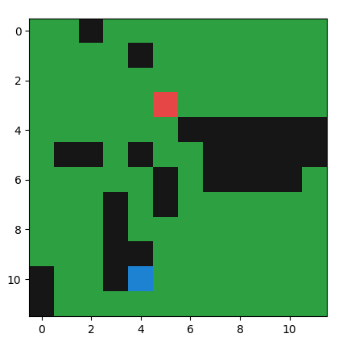
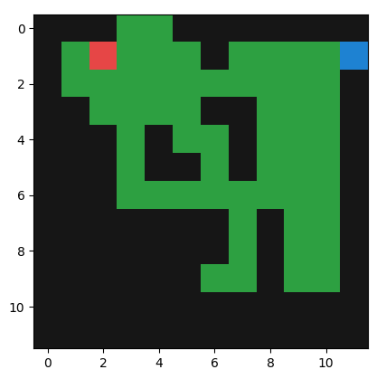
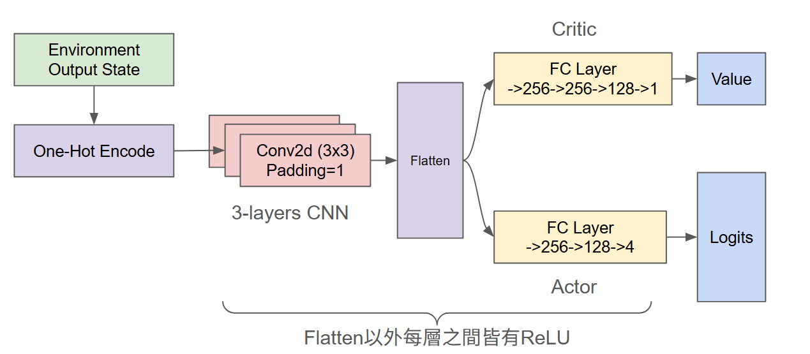

# 貪吃蛇AI

基於強化學習 (Reinforcement Learning) 的實作專案，訓練 AI 在經典貪吃蛇遊戲中進行遊玩。
本專案包含並支援了 **PPO (Proximal Policy Optimization)** 以及 **DQN (Deep Q-Network)** 兩種算法的實作。

## 視覺表現

### 遊戲實機遊玩
| PPO Agent | DQN Agent |
| :---: | :---: |
| <video src="https://github.com/user-attachments/assets/061ab3ae-ce4d-4087-b7ce-c4cdc2310f22" controls></video> | <video src="https://github.com/user-attachments/assets/bdf30fa5-5b86-4bb7-a1fe-56534f1cac18" controls></video> |


### 訓練表現記錄
| PPO 訓練最大分數記錄 | DQN 訓練最大分數記錄 |
| :---: | :---: |
|  |  |

#### 模型架構參考 (PPO)


## 安裝

1. 克隆或下載此專案，並進入資料夾：
   ```bash
   git clone https://github.com/Ethanol017/Snake-AI.git
   cd Snake-AI
   ```
2. 安裝必要的依賴套件
   ```bash
   pip install -r requirements.txt
   ```
## 檔案結構

- `model.py`: 定義了神經網路，包含了 `SnakePPO` 和 `SnakeDQN` 兩個網路。
- `train.py`: 訓練模型的主要腳本。
- `test.py`: 測試跟視覺化已訓練好的模型。
- `Gym-Snake/`: 貪吃蛇的自訂 Gym 環境原始碼。
- `models/`: 存放訓練中或訓練完成的 `.pth` 權重檔。
- `logs/`: TensorBoard 的實驗數據與紀錄檔。
- `assets/`: 相關的媒體資源與表現成效圖片。
- `tools`： 各項工具，如：環境測試、視覺化、Tensorboard工具
